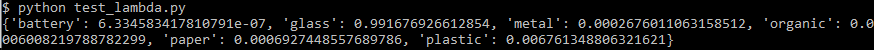

# Waste Image Classification Project

## Problem

The goal of this project is to identify the type of waste based on its image using a neural network constructed with Tensorflow. There are 6 categories of waste considered, so this is a multiclass classification problem. The project involved the following steps:
* exploring and preparing the dataset;
* comparing the performance of two Keras neural networks pre-trained on Imagenet and selecting one for transfer learning;  
* tuning the parameters of the model (learning rate, size of inner layer, dropout rate) and determining effective data augmentation;  
* training the tuned model on a larger image size set and saving the best one in terms of accuracy;  
* creating a web application with the final model using Flask and Gunicorn and deploying it locally with Docker;
* creating AWS Lambda function with the final model in a Docker container and making it accessible on the cloud via an API.

The final model was constructed from ResNet50 base model with an additional inner layer of 100 neurons and achieved the accuracy of 91% on the validation dataset.

## Dataset

The dataset can be accessed via this [link to Kaggle](https://www.kaggle.com/datasets/quangtheng/garbage-classification-6-classes-775class/). See the following section for instructions on how to download the dataset for the project to run properly.

The dataset consists of images classified into 6 categories:

* plastic
* paper
* battery
* glass
* organic
* metal

Accordingly, the neural network is designed to have 6 output nodes, which reflect the probability of a particular image to fall into the corresponding class.

This dataset was combined from other two datasets for the sake of balancing. Thus, in this dataset, the size of each class is equal to 775 images.

## Contents

The following is the decription of the project components:

`notebook.ipynb` is the Jupyter notebook containing dataset preparation, EDA, model training, tuning and evaluation.

`train.py` is the script used for training the final model and saving it as `resnet50_best_model.h5`.

`convert.py` is the script used to convert the above Tensorflow model file into `waste-model.tflite`.

`predict.py` is the script for creating a Flask web service with the final model.

`Pipfile` and `Pipfile.lock` contain the list of Python dependencies used to run the service.

`Dockerfile.local` is the Dockerfile for containerization of the Flask app.

`test_local.py` is the script for testing the web service locally with `jar.jpg` image.

`lambda_function.py` is the script for running on AWS Lambda, in a Docker container created with `Dockerfile.lambda`.

`test_lambda.py` is the script for testing the AWS Lambda function via API with `jar.jpg` image.

## Setup

Below are the steps for setting up the project on your machine:

#### 1. Clone the project from repository

```
git clone https://github.com/ValeryKarnevich/waste-image-classification.git
cd waste-image-classification
```

**2. Download the dataset from Kaggle in `.zip` format**

```
kaggle datasets download -d quangtheng/garbage-classification-6-classes-775class
```

Note: if you do not have the `kaggle` CLI utility, see https://www.kaggle.com/docs/api for installation and authentification instructions.

**3. Unzip the dataset into the `~/data` folder**

```
unzip garbage-classification-6-classes-775class.zip -d ~/data
```

**4. Install the Python dependencies from the `Pipfile`**

```
pipenv install
```

Note: in `notebook.ipynb` there are some additional libraries used (`scipy`, `tensorflow`, `pandas`, `seaborn`, `plotly`). If you want to run the notebook, you can install these libraries with `pip`. 

## Local Service

Below are the steps for running the Flask application with the model locally:

#### 1. Build the Docker image

```
docker build -t project-local -f Dockerfile.local .
```

#### 2. Run the Docker container from the created image

```
docker run -it --rm -p 9696:9696 project-local
```

#### 3. Test the model

From another terminal, navigate to the project folder and run the test script:

```
pipenv shell
python test_local.py
```

The script sends the URL of `jar.jpg` for the model to classify. If the setup is correct, the following output should be displayed:

```
{'battery': 6.334583417810791e-07, 'glass': 0.991676926612854, 'metal': 0.0002676011063158512, 'organic': 0.0006008219788782299, 'paper': 0.0006927448557689786, 'plastic': 0.006761348806321621}
```

**4. Further service interaction**

To interact with the service in the active container, send a POST request to `http://localhost:9696/classify_waste` in the following JSON format (substitute the URL of an image you want to classify into `<url>`):

```
{"url": "<url>"}
```

The service will respond with the probability of the image belonging to each of the 6 types, similar to the above output of the test script.

You may use a script similar to `test_local.py` for interacting with the service.

## Cloud Service

The Docker container built from `Dockerfile.lambda` containing the `waste-model.tflite` and `lambda_function.py` was published to AWS ECR. The container was used to create the AWS Lambda function, which was then associated to a REST API, available at:

https://3ybj5ymr0c.execute-api.us-east-2.amazonaws.com/test/classify

This API works similar to the local service: you send a POST request in `{"url": "<url>"}` JSON format (where `<url>` is the URL of an image) to the above address and receive the probabilities of the image falling into each class.

You may test this API by running the script `test_lambda.py`, which sends the URL of `jar.jpg` for the model to classify. Correspondingly, you should see the same output as with the local run:


